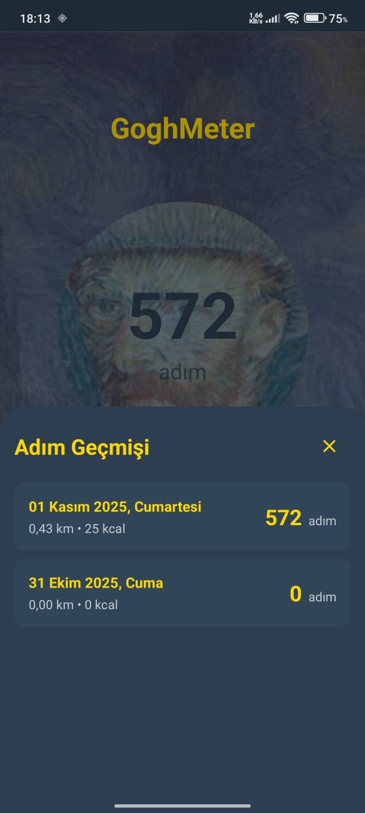

# GoghMeter

Van Gogh temasında, düşük pil tüketimiyle arka planda çalışan bir pedometre (adım sayar) uygulaması.

## Özellikler

- **Arka Planda Çalışma**: Uygulama kapalıyken bile adımlarınızı sayar
- **Düşük Pil Tüketimi**: Optimize edilmiş algılama sistemiyle minimum pil kullanımı
- **Otomatik Günlük Sıfırlama**: Her gece yarısı otomatik olarak sıfırlanır ve günün verilerini kaydeder
- **Geçmiş Görüntüleme**: Günlük adım geçmişinizi görüntüleyebilirsiniz
- **Mesafe ve Kalori Takibi**: Adımlarınıza göre mesafe (km) ve yakılan kalori hesaplar
- **Van Gogh Teması**: Sanatsal ve estetik bir kullanıcı arayüzü

## Teknik Detaylar

- **Platform**: Android
- **Dil**: Kotlin
- **UI Framework**: Jetpack Compose
- **Mimari**: MVVM (Model-View-ViewModel)
- **Veritabanı**: Room Persistence Library
- **Arka Plan Servisi**: Foreground Service
- **Sensör**: Android Sensor API (TYPE_STEP_COUNTER)

## Ekran Görüntüleri

### Ana Ekran


### Adım Sayacı


### Geçmiş Ekranı


## Gereksinimler

- Android 8.0 (API 26) ve üzeri
- ACTIVITY_RECOGNITION izni (Android 10+)
- POST_NOTIFICATIONS izni (Android 13+)

## Kurulum

1. Projeyi klonlayın:
```bash
git clone [repository-url]
```

2. Android Studio'da açın

3. Gradle sync yapın

4. Uygulamayı çalıştırın

## Kullanım

1. İlk açılışta gerekli izinleri verin
2. Uygulama otomatik olarak arka planda çalışmaya başlar
3. Ana ekranda güncel adım sayısı, mesafe ve kalori görüntülenir
4. "Geçmiş" butonuna tıklayarak günlük adım geçmişinizi görüntüleyebilirsiniz

## Mimari

- **MainActivity**: UI katmanı, Compose ekranları
- **PedometerViewModel**: UI ve data katmanı arasındaki köprü
- **PedometerRepository**: Veri erişim katmanı
- **StepCounterService**: Arka plan servisi, adım sayma işlemleri
- **BootReceiver**: Cihaz açılışında servisi başlatır
- **MidnightReceiver**: Gece yarısı sıfırlama işlemlerini yönetir
- **Room Database**: Yerel veritabanı, adım kayıtları ve durum yönetimi


